Let's build this properly. Here's the full technical roadmap:

---Here's the full technical roadmap with visual diagrams: #

Now the full tech stack breakdown:


Now here's the complete technical requirements document you can actually code from:

---

## Codebase Context Snapshot (May 8, 2026)

**What is in this repo**

- Android app (primary): Kotlin + Compose + Room + WorkManager + AlarmManager, Koin for DI.
- riri_frontend: Vite + React + React Router, Figma-derived UI bundle (design reference).
- reaction_stickers: assets folder for Riri expressions/stickers.

**Android app structure (actual state)**

- App entry: `MainActivity` uses Compose NavHost with routes for onboarding, home (dashboard), chat, profile, settings; Add Reminder is a modal bottom sheet.
- DI: Koin module wires Room DB, DAOs, repositories, AI engines, notifications, share use case, and ViewModels.
- Data: Room entities for reminders, user stats, and chat messages; DAOs and repositories present.
- UI: Dashboard, onboarding, chat, profile, and settings screens exist and are wired; theme is dark only with brand colors.
- Notifications: AlarmManager exact scheduling + BootReceiver for weekly chaos reports; notification copy uses personality tone.
- Share cards: `BuildShareCardUseCase` + `ShareService` can generate and share a bitmap via FileProvider.

**App configuration (current)**

- Package/namespace: `com.riri.app`, minSdk 26, target/compile 35.
- DI: Koin only (no Hilt); Room with KSP: 2.3.7; AGP 9.2.0; Java 11 bytecode.

**AI configuration (current)**

- Chat + categorization use `LocalLLMEngine` backed by MediaPipe GenAI (0.10.35).
- AICore dependency remains commented out (experimental).
- Classification path uses ONNX fallback (1.24.2) + keyword classifier.

**AI/ML stack (actual state)**

- `LocalLLMEngine` (MediaPipe GenAI) handles core chat and complex categorization logic.
- `AIEngineRouter` orchestrates the hierarchy: Local LLM -> ONNX Fallback -> Keyword Classifier.
- `ModelDownloadManager` handles the initial .task model provisioning.
- `TaglishParser` performs heuristic time/title extraction for quick reminder adding.
- `WhisperEngine` provides a placeholder for future on-device speech-to-text.

**Reviewer notes (code reality vs plan)**

- Settings and profile screens are implemented and wired in navigation, but Phase 1 checklist still marks them as pending.
- Share card checklist says incomplete, yet `BuildShareCardUseCase` and `ShareService` exist and are used in profile; verify output quality and final UX before marking done.
- `AIEngineRouter` has a placeholder Gemma model path and does not actually initialize `LlmInference`; update or remove to avoid confusion.
- `ReminderAlarmReceiver` always uses `PersonalityMode.BESTIE`; it ignores the saved user preference and reminder-specific mode.
- `TaglishParser` uses a `now` timestamp captured at object creation, not per-parse; time-based parsing may drift if the app stays open.
- Duplicate `ProcrastinationLevel` enums exist in AI modules; consolidate to avoid mismatched usage.
- `build.gradle.kts` includes overlapping ONNX dependencies (libs + direct); verify intended runtime and remove duplicates.

**Bug fixes applied (May 9, 2026)**

- **Lite AI Mode**: Disabled mandatory LLM download in Onboarding. Users can now skip the download and use fallback AI logic (Lite Mode) for immediate testing.
- **UI Interactivity**: Fixed and verified click handlers across all screens. Reminder cards are now fully clickable to toggle completion.
- **App Icon**: Updated the app launcher icon to use `riri_logo.png` from the reaction stickers.
- **UI Refactor**: Realigned all major screens (Onboarding, Dashboard, Chat, Profile, Settings) with the brand design reference. Updated theme colors, gradients, and typography.
- **Chat Logic Fix**: Fixed `LocalLLMEngine` to ensure `onComplete` is always called. Updated `ChatViewModel` to auto-load the model before sending messages if it is ready but not loaded.
- **MediaPipe API Update**: Updated `LocalLLMEngine.kt` to comply with version 0.10.35. Result listeners are now passed directly to `generateResponseAsync` instead of the options builder.
- Guarded `localLLM.load()` in `ChatViewModel.kt` with `isModelReady()` to prevent first-launch crashes.
- Fixed `LocalLLMEngine.kt` compilation errors by explicitly specifying lambda types for `setResultListener`.
- notification receiver now respects saved notification toggle + personality mode.
- Taglish parser now computes time relative to the current parse call.
- Removed duplicate `ProcrastinationLevel` enum to avoid ambiguity.

**Frontend design bundle (riri_frontend)**

- React Router routes for onboarding, home, report, barkada, profile, settings; used for UI reference only.
- Vite-based dev setup; no backend integration seen in this bundle.

**Dev tooling**

- Post-hook runs `gradlew ktlintFormat`; added Gradle ktlint plugin in root so the task exists and the hook stops failing.
- JitPack access uses the JitPack `authToken` in `~/.gradle/gradle.properties` (per JitPack private repo docs) with password set to `.`.

## Status Summary (May 8, 2026)

**Scope recap**

- Android app (Kotlin, Compose, MVVM + Clean Architecture), offline-first AI (Gemini Nano with ONNX fallback).
- Local persistence via Room + DataStore; notifications via WorkManager + AlarmManager; Phase 2 adds location and QR generation.

**Progress snapshot**

- Project setup, dependencies, and folder structure defined; theme and brand colors set.
- Core data layer (entities/DAOs/database/repositories) marked complete.
- AI layer (Gemini Nano + fallback + Taglish parsing + category classification) marked complete.
- Notification system (copy, scheduling, boot reschedule) marked complete.
- UI screens: onboarding, home, add reminder done; settings/profile pending.
- Share cards still pending, including actual bitmap generation and share intent.
- Testing plan exists but not executed.

**Reviewer notes (risks/gaps)**

- Build checklist says dependencies are added, but actual build files are not verified here; confirm `build.gradle.kts` matches the listed versions.
- Share card section shows a use case, but checklist marks it incomplete; align code vs checklist to avoid false readiness.
- AI dependency `aicore:0.0.1-exp` is experimental; plan for graceful downgrade and device capability checks.
- Exact alarm permission and boot receiver behavior vary by OEM; add device matrix testing and fallback scheduling.
- Data model categories include BAHALA_NA in reminders but AI categorization list excludes it; reconcile enum/category lists.

**Next focused milestones**

- Finish settings + profile screens and wire personality mode selection to notifications.
- Implement share card generation + share intent; validate rendering on multiple DPIs.
- Execute Phase 1 testing checklist; capture defects and update this plan.

## Riri — Full Technical Requirements

---

### Project Setup

```
Language: Kotlin
Min SDK: API 26 (Android 8.0)
Target SDK: API 35 (Android 15)
Architecture: MVVM + Clean Architecture
Build system: Gradle (Kotlin DSL)
```

---

### Dependencies — Full List

```kotlin
// build.gradle.kts (app level)

dependencies {

  // UI
  implementation("androidx.compose.ui:ui")
  implementation("androidx.compose.material3:material3")
  implementation("androidx.compose.ui:ui-tooling-preview")
  implementation("androidx.navigation:navigation-compose:2.7.x")
  implementation("androidx.lifecycle:lifecycle-viewmodel-compose")
  implementation("io.coil-kt:coil-compose:2.x") // Riri character images

  // AI — Offline
  implementation("com.google.mediapipe:tasks-genai:0.10.35")
  // Fallback:
  implementation("com.microsoft.onnxruntime:onnxruntime-android:1.24.2")

  // Database
  implementation("androidx.room:room-runtime:2.6.x")
  implementation("androidx.room:room-ktx:2.6.x")
  kapt("androidx.room:room-compiler:2.6.x")

  // Background work + notifications
  implementation("androidx.work:work-runtime-ktx:2.9.x")
  implementation("androidx.core:core-ktx") // AlarmManager access

  // Preferences
  implementation("androidx.datastore:datastore-preferences:1.0.x")

  // Location (Phase 2)
  implementation("com.google.android.gms:play-services-location:21.x")

  // Share card generation
  // Canvas API is built-in, no extra dependency needed

  // Coroutines
  implementation("org.jetbrains.kotlinx:kotlinx-coroutines-android:1.7.x")

  // Serialization
  implementation("org.jetbrains.kotlinx:kotlinx-serialization-json:1.6.x")

  // Testing
  testImplementation("junit:junit:4.13.x")
  androidTestImplementation("androidx.test.espresso:espresso-core:3.5.x")
  androidTestImplementation("androidx.compose.ui:ui-test-junit4")
}
```

---

### Folder Structure

```
app/
└── src/main/
    ├── java/com/riri/app/
    │   ├── core/
    │   │   ├── ai/
    │   │   │   ├── AIEngineRouter.kt
    │   │   │   ├── LocalLLMEngine.kt
    │   │   │   ├── ModelDownloadManager.kt
    │   │   │   ├── OnnxFallbackEngine.kt
    │   │   │   ├── KeywordClassifier.kt
    │   │   │   └── TaglishParser.kt
    │   │   ├── notifications/
    │   │   │   ├── RiriNotificationManager.kt
    │   │   │   ├── ReminderAlarmReceiver.kt
    │   │   │   ├── PersonalityNotificationCopy.kt
    │   │   │   └── BootReceiver.kt
    │   │   └── utils/
    │   │       └── ShareService.kt
    │   │
    │   ├── data/
    │   │   ├── db/
    │   │   │   ├── RiriDatabase.kt
    │   │   │   ├── dao/
    │   │   │   │   ├── ReminderDao.kt
    │   │   │   │   ├── UserStatsDao.kt
    │   │   │   │   └── BarkadaDao.kt
    │   │   │   └── entities/
    │   │   │       ├── ReminderEntity.kt
    │   │   │       ├── UserStatsEntity.kt
    │   │   │       └── BarkadaEntity.kt
    │   │   ├── preferences/
    │   │   │   └── UserPreferencesDataStore.kt
    │   │   └── repository/
    │   │       ├── ReminderRepository.kt
    │   │       ├── StatsRepository.kt
    │   │       └── BarkadaRepository.kt
    │   │
    │   ├── domain/
    │   │   ├── model/
    │   │   │   ├── Reminder.kt
    │   │   │   ├── UserStats.kt
    │   │   │   ├── PersonalityMode.kt
    │   │   │   └── BarkadaGroup.kt
    │   │   └── usecase/
    │   │       ├── CreateReminderUseCase.kt
    │   │       ├── GenerateChaosReportUseCase.kt
    │   │       ├── DetectProcrastinationUseCase.kt
    │   │       └── BuildShareCardUseCase.kt
    │   │
    │   ├── ui/
    │   │   ├── theme/
    │   │   │   ├── Color.kt
    │   │   │   ├── Type.kt
    │   │   │   └── RiriTheme.kt
    │   │   ├── components/
    │   │   │   ├── RiriCharacter.kt
    │   │   │   ├── ReminderCard.kt
    │   │   │   ├── ChaosReportCard.kt
    │   │   │   └── BarkadaCard.kt
    │   │   └── screens/
    │   │       ├── home/
    │   │       │   ├── HomeScreen.kt
    │   │       │   └── HomeViewModel.kt
    │   │       ├── report/
    │   │       │   ├── ChaosReportScreen.kt
    │   │       │   └── ChaosReportViewModel.kt
    │   │       ├── barkada/
    │   │       │   ├── BarkadaScreen.kt
    │   │       │   └── BarkadaViewModel.kt
    │   │       ├── profile/
    │   │       │   ├── ProfileScreen.kt
    │   │       │   └── ProfileViewModel.kt
    │   │       └── onboarding/
    │   │           ├── OnboardingScreen.kt
    │   │           └── OnboardingViewModel.kt
    │   │
    │   └── workers/
    │       ├── ReminderWorker.kt
    │       ├── ChaosReportWorker.kt
    │       └── PatternAnalysisWorker.kt
    │
    └── res/
        ├── drawable/
        │   └── (all Riri expression PNGs here)
        ├── raw/
        │   └── (AI model files if bundled)
        └── values/
            ├── colors.xml
            └── strings.xml
```

---

### Database Schema

```kotlin
// ReminderEntity.kt
@Entity(tableName = "reminders")
data class ReminderEntity(
  @PrimaryKey(autoGenerate = true) val id: Long = 0,
  val title: String,
  val description: String?,
  val category: String,        // SCHOOL, HEALTH, SOCIAL, PERSONAL, ERRANDS, BAHALA_NA
  val dueDateTime: Long,       // Unix timestamp
  val isCompleted: Boolean = false,
  val isRecurring: Boolean = false,
  val recurringInterval: String?, // DAILY, WEEKLY, CUSTOM
  val snoozeCount: Int = 0,
  val rescheduleCount: Int = 0, // triggers Bahala Na detection
  val createdAt: Long = System.currentTimeMillis(),
  val completedAt: Long? = null,
  val personalityMode: String = "BESTIE" // notification tone
)

// UserStatsEntity.kt
@Entity(tableName = "user_stats")
data class UserStatsEntity(
  @PrimaryKey val weekStartDate: Long,
  val totalSet: Int,
  val totalCompleted: Int,
  val totalIgnored: Int,
  val totalRescheduled: Int,
  val currentStreak: Int,
  val longestStreak: Int,
  val personalityTitle: String,
  val procrastinationScore: Float
)

// BarkadaEntity.kt
@Entity(tableName = "barkada")
data class BarkadaEntity(
  @PrimaryKey val groupId: String,
  val groupName: String,
  val members: String, // JSON array of member names
  val createdAt: Long
)
```

---

### AI Integration — MediaPipe GenAI

```kotlin
// LocalLLMEngine.kt
class LocalLLMEngine(context: Context) {
  // Uses MediaPipe Tasks GenAI for on-device inference
  // Supports .task model files (Gemma, Phi, etc.)
  
  suspend fun categorizeReminder(input: String): ReminderCategory {
    // LLM-based categorization logic
  }
}
```

---

### Notification System

```kotlin
// PersonalityNotificationCopy.kt
object PersonalityNotificationCopy {

  fun getNotificationText(
    mode: PersonalityMode,
    reminderTitle: String,
    snoozeCount: Int,
    daysOverdue: Int
  ): Pair<String, String> { // title, body

    return when (mode) {

      PersonalityMode.BESTIE -> when {
        daysOverdue >= 3 ->
          Pair("Bestie... 👀",
            "Ito na yung ika-${daysOverdue} araw mo sa '$reminderTitle'. Okay ka lang?")
        snoozeCount >= 2 ->
          Pair("Huy! 🔔",
            "I-snooze mo ulit? '$reminderTitle' Hindi pa rin natin magagawa nyan ng ganyan.")
        else ->
          Pair("Hoy! Riri here 👋",
            "Uy, reminder mo: $reminderTitle")
      }

      PersonalityMode.MALUPIT -> when {
        daysOverdue >= 3 ->
          Pair("Day $daysOverdue. Seriously.",
            "'$reminderTitle'. I have nothing more to say.")
        else ->
          Pair("Get up. 🔔",
            "$reminderTitle. Now.")
      }

      PersonalityMode.CHILL -> Pair(
        "Hey, no rush ✌️",
        "Just checking — $reminderTitle when you're ready"
      )

      PersonalityMode.TITA -> Pair(
        "Anak, naalala mo ba? 🙏",
        "Yung '$reminderTitle' mo, hindi pa tapos. Gawin mo na bago ka pa makalimot ulit."
      )
    }
  }
}
```

---

### Share Card Generation

```kotlin
// BuildShareCardUseCase.kt
class BuildShareCardUseCase {

  fun generateWeeklyReport(stats: UserStats): Bitmap {
    val width = 1080
    val height = 1920 // vertical for stories
    val bitmap = Bitmap.createBitmap(width, height, Bitmap.Config.ARGB_8888)
    val canvas = Canvas(bitmap)

    // Background
    canvas.drawColor(Color.parseColor("#1A1A2E"))

    val paint = Paint(Paint.ANTI_ALIAS_FLAG)

    // Title
    paint.color = Color.WHITE
    paint.textSize = 72f
    paint.typeface = Typeface.DEFAULT_BOLD
    canvas.drawText("Weekly Receipts 🧾", 80f, 200f, paint)

    // App name watermark
    paint.textSize = 36f
    paint.color = Color.parseColor("#7C5CBF")
    canvas.drawText("RIRI", 80f, 260f, paint)

    // Stats block
    paint.textSize = 52f
    paint.color = Color.WHITE
    canvas.drawText("Nagset ka ng ${stats.totalSet}", 80f, 420f, paint)
    canvas.drawText("Nagawa: ${stats.totalCompleted} ✅", 80f, 500f, paint)
    canvas.drawText("Ni-reschedule: ${stats.totalRescheduled} 🔄", 80f, 580f, paint)

    // Personality title
    paint.textSize = 64f
    paint.color = Color.parseColor("#F5A623")
    canvas.drawText(stats.personalityTitle, 80f, 760f, paint)

    // Closing hugot line
    paint.textSize = 44f
    paint.color = Color.parseColor("#E8D5FF")
    canvas.drawText("Sana ganito lagi.", 80f, 900f, paint)

    // Riri character (load from drawable)
    val ririDrawable = BitmapFactory.decodeResource(resources, R.drawable.riri_holding_receipt)
    canvas.drawBitmap(ririDrawable, 600f, 700f, null)

    // QR code area (Phase 2 — add ZXing library)
    paint.color = Color.parseColor("#7C5CBF")
    paint.textSize = 36f
    canvas.drawText("I-download na rin. riri.app", 80f, 1800f, paint)

    return bitmap
  }
}
```

---

### Theme Setup

```kotlin
// Color.kt
object RiriColors {
  val PrimaryViolet = Color(0xFF7C5CBF)
  val Amber = Color(0xFFF5A623)
  val DeepCharcoal = Color(0xFF1A1A2E)
  val OffWhite = Color(0xFFF0F0F0)
  val SoftLavender = Color(0xFFE8D5FF)
  val GradientPink = Color(0xFFFF6B9D)
}

// RiriTheme.kt
@Composable
fun RiriTheme(content: @Composable () -> Unit) {
  val colorScheme = darkColorScheme(
    primary = RiriColors.PrimaryViolet,
    secondary = RiriColors.Amber,
    background = RiriColors.DeepCharcoal,
    surface = Color(0xFF252540),
    onPrimary = RiriColors.OffWhite,
    onBackground = RiriColors.OffWhite,
  )
  MaterialTheme(
    colorScheme = colorScheme,
    content = content
  )
}
```

---

### AndroidManifest Permissions

```xml
<!-- AndroidManifest.xml -->
<uses-permission android:name="android.permission.POST_NOTIFICATIONS"/>
<uses-permission android:name="android.permission.SCHEDULE_EXACT_ALARM"/>
<uses-permission android:name="android.permission.RECORD_AUDIO"/> <!-- voice input -->
<uses-permission android:name="android.permission.ACCESS_FINE_LOCATION"/> <!-- Phase 2 -->
<uses-permission android:name="android.permission.ACCESS_COARSE_LOCATION"/> <!-- Phase 2 -->
<uses-permission android:name="android.permission.VIBRATE"/>
<uses-permission android:name="android.permission.RECEIVE_BOOT_COMPLETED"/>
<!-- reschedule alarms after reboot -->
```

---

### Phase 1 Build Checklist

Copy this and check off as you go:

```
SETUP
[x] Android project created (Kotlin, Jetpack Compose)
[x] All dependencies added to build.gradle.kts
[x] Folder structure created
[x] RiriTheme.kt configured with brand colors
[x] Dark mode default set

DATABASE
[x] ReminderEntity defined
[x] UserStatsEntity defined
[x] RiriDatabase.kt created
[x] All DAOs written
[x] Repository layer connected

AI
[x] GeminiNanoEngine.kt written
[x] OnnxFallbackEngine.kt as backup
[x] TaglishParser handles common Filipino input
[x] CategoryClassifier working on basic categories

NOTIFICATIONS
[x] RiriNotificationManager set up
[x] PersonalityNotificationCopy written (all 4 modes)
[x] WorkManager scheduling working
[x] AlarmManager for exact timing
[x] Boot receiver for rescheduling after restart

UI SCREENS
[x] Onboarding flow (4 screens)
[x] Home screen with today's reminders
[x] Add reminder screen (voice + text)
[x] Settings screen (personality mode switch)
[x] Basic profile screen

RIRI CHARACTER
[x] Expression PNGs imported to res/drawable
[x] RiriCharacter composable built
[x] Expressions mapped to app moments

SHARE CARDS
[ ] BuildShareCardUseCase written
[ ] Weekly report card generates correctly
[ ] Share intent working (IG, Messenger, TikTok)
[ ] Riri watermark on all cards

TESTING
[ ] 20–30 real Filipino Gen Z beta testers
[ ] Test on low-end devices (3GB RAM)
[ ] Test Taglish voice input
[ ] Test notification delivery
```

---
